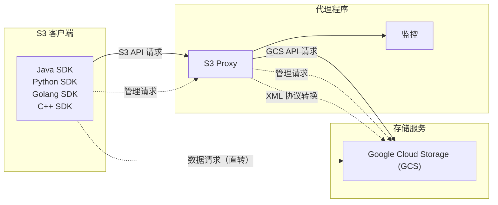

1. 项目概述
1.1 背景
小红书（客户）正在将核心基础设施从阿里云（新加坡区域）迁移至 Google Cloud Platform（北美区域）。客户应用层大量采用原生 AWS S3 SDK（覆盖 Go、Java、Python、C++ 四大语言栈）进行对象存储访问，业务线众多且调用链路深度耦合 S3 API 语义。
客户核心诉求：在不修改任何应用代码的前提下，实现从 AWS S3 到 Google Cloud Storage (GCS) 的平滑切换。
经技术调研确认，GCS 提供的 S3 兼容 API 存在多项协议差异（XML Schema 不兼容、Header 语义偏差、存储类型命名不一致、版本控制字段映射缺失等），无法做到原生透传。因此，需要设计并交付一套 S3-to-GCS 协议翻译中间层（S3 Proxy），部署于客户 VPC 内部，对上游应用完全透明。

1.2 业务规模与技术挑战
- 计算规模：小红书当前集群约 13 万核，对象存储为核心数据通路
- 性能要求：Proxy 作为数据面关键路径，必须保证 低附加延迟，不能成为吞吐瓶颈
- 可用性要求：7×24 不间断服务，支持滚动升级与优雅排水（Graceful Shutdown）
- 多 SDK 生态：需同时兼容 Go V1/V2、Java V1/V2、Python (boto3)、C++ 四套 AWS SDK 的行为差异
- 数据完整性：在禁用 aws-chunked 校验的场景下，仍需通过 TLS AEAD 保障传输完整性
注：截至方案编写时，尚未获取到客户业务侧的对象存储访问量与峰值性能指标数据。后续需与客户对齐 QPS / 带宽基线以完成容量规划。

2. 技术方案
2.1 整体架构
S3 Proxy 采用 Go 语言实现（高并发 Goroutine 模型、低内存占用、快速冷启动），部署为客户 VPC 内的无状态微服务。
暂时无法在飞书文档外展示此内容
架构分为三个层次：
- 数据面（Data Plane）：高性能流式反向代理，处理对象的上传、下载、删除、列举等高频操作。核心关注吞吐、延迟与连接复用。
- 控制面（Control Plane）：低频桶配置管理 API 的协议翻译层，处理 Lifecycle、CORS、Logging、Website、Tagging 等 S3 XML ↔ GCS JSON 的双向转换。
- 运维面（Operability，合并在控制面计划中）：健康检查、可观测性（Prometheus Metrics + 结构化日志）

2.2 部署模式
两种候选部署拓扑，根据客户流量规模渐进选择：
维度
GKE
运维成本
高（集群管理）
弹性伸缩
基于 HPA 指标
冷启动
无冷启动
TCP 连接池
完全可控
成本模型
资源池利用率驱动
2.3 建议
- 服务可用性
为了保证在线服务稳定性，建议部署2套 s3proxy服务，1套提供在线服务使用，1套提供大数据服务使用。
- 回源配额
回源GCS配额（QPS/吞吐）要与业务使用量匹配。
3. 研发Scope & Schedule
｜ 功能范围和计划安排，每个开发点包含开发 + 测试
3.1 总体时间线
- 项目启动：2026-04-07（W1 Monday）
- 代码第一次交付联调（数据面）：2026-04-20
- 代理中间件交付：2026-04-30
- 总工期：约 3.5 周（16 个工作日）
- 持续维护期：交付后 6 个月
3.2 数据面
暂时无法在飞书文档外展示此内容
3.2 控制面
暂时无法在飞书文档外展示此内容
 
3.3 客户端适配

针对已知的多语言 SDK 兼容性问题，提供客户端配置方案与接入指南：
- Flexible Checksums 绕过：设置 AWS_REQUEST_CHECKSUM_CALCULATION=WHEN_REQUIRED 禁用 aws-chunked 封装，未设置参数输出错误：WARN Rejected aws-chunked request: GCS does not support Flexible Checksums trailers. Client must set AWS_REQUEST_CHECKSUM_CALCULATION=WHEN_REQUIRED content-encoding=aws-chunked method=PUT uri=/bucket/key user-agent=aws-sdk-go-v2/1.75.1
- Java V2 CopyObject 修复：显式绑定 ApacheHttpClient 以正确携带 Content-Length: 0
- Endpoint切换：通过定义自定义域名并调整DNS解析指向GCS直连地址，在不更改业务侧endpoint和SDK的前提下消除代理与直连的差异，同时需评估服务端对自定义域名的支持能力。
- go v2 sdk 的  gzip 中间件 disable，在proxy服务端处理，禁止 Go 的 HTTP Transport 自动处理 gzip。
3.4 本期不纳入范围
功能
原因
建议规避方案
ACLs & Bucket Policies
S3 ACL/Policy 与 GCS IAM 模型根本性不兼容，对象级 Tag-based ABAC 不可行
抛异常/Warning + 定位用户
DeleteObjects 批量删除
需在 Proxy 扇出最多 1,000 个并发 GCS 调用，存在资源耗尽风险
抛异常/Warning + 定位用户
Flexible Checksums 解包
aws-chunked 流解析内存/带宽开销极大，影响数据面吞吐
抛异常/Warning + 定位用户
UploadPartCopy
需大量缓冲内存，违反流式转发原则
抛异常/Warning + 定位用户
4. 测试计划
4.1 测试范围
采用四层测试金字塔，确保交付质量：
层级
覆盖范围
执行方式
切入点
Unit Tests
pkg/translate 各翻译模块的输入输出验证（基线 17 条用例）
go test 本地执行
包含在研发过程中
Integration Tests
独立 Go module，自动拉起 DryRun 本地 Proxy 做端到端接口验证
CI 自动触发
包含在研发过程中
E2E Acceptance
Functional（功能覆盖）+ Stability（长时间高并发）+ Benchmark（P50/P95/P99 延迟基准）
真实 GCS 环境
全链路测试
SDK 兼容性
Go / Java V1&V2 / Python / C++ 四套 SDK 全量对接验证
手动 + 自动化
全链路测试
CI/CD 流水线基于 GitHub Actions，包含 3 个并行 Job（Unit / Integration / E2E），每次 PR 自动触发。

4.2 测试计划
暂时无法在飞书文档外展示此内容

5. 人员安排
人员
角色
职责
张维力
项目负责人
负责项目进度跟踪推动，资源协调
王京平
系统架构师
负责项目整体架构设计及技术攻关
张帆帆
研发负责人
负责人代理中间件主要逻辑的研发和交付及后期的BUG修复
陈坚
研发负责人
负责人代理中间件主要逻辑的研发和交付及后期的BUG修复
封磊
测试负责人
负责人GCP测试环境搭建，E2E测试
6. 风险与缓解措施
风险项
影响
缓解措施
工期紧张（3 周完成全部开发+测试）
交付延期
优先数据面 & 控制面交付，并发研发和测试
缺乏客户侧 QPS/带宽基线数据
无法做精准容量规划
先交付 Benchmark 套件，上线后根据 Prometheus 指标动态调参
Proxy 引入额外延迟
影响客户体验
Go 高性能转发 + HTTP/2 连接复用；P95 延迟目标 <5ms
多 SDK 行为差异
兼容性回归
四套 SDK 全量 E2E 覆盖 + CI 自动回归

7. 项目文档
原型仓库：https://github.com/yul88/S3Proxy4GCS
开发仓库：https://github.com/Nctllnty/S3Proxy4GCS
AWS S3 客户端迁移至 Google Cloud Storage 指引.pdf
AWS S3 SDK 代码示例：https://docs.aws.amazon.com/zh_cn/code-library/latest/ug/s3_code_examples.html
原始需求分析：RB-S3迁移GCS

